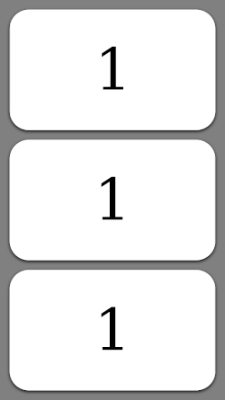
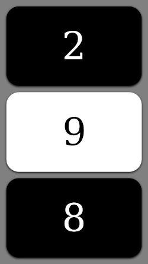
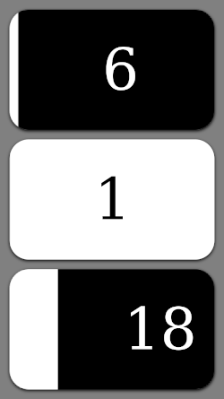

# Dice Spinner

An app for digitally rolling dice. The dice are rendered like the tumbers in a slot machine, and are activated with a mouse or touch swipe gesture.

You can check out the online demo here:

https://writtenwordinteractive.com/dice/

## Technical details

This app is more of a tech demo than something particularly useful. (though it's fun to spin the dials around!) The spin effect was done in Javascript and makes heavy use of the transform style attribute, making it very fast. There's also some basic physics "simulation" involved where the spinner experiences friction to slow it down, and is also "magnetically drawn" to the nearest stopping position. This helps improve the "feel" of the spin and makes the app feel a bit more tangible.

The looping was done by some basic DOM manipulation. Elements are removed when out of frame, and then tacked onto the opposite end so they eventually come back into view.

Initially I considered using a canvas to render each spinner. In some ways that would have been easier, though sticking to HTML elements means things are easier to style with CSS. As well, this code could easily be refactored into a reusable UI element, with each tile showing a different page of content, image, form control etc. (eg similar in use to ion-slide)

## Screenshots

